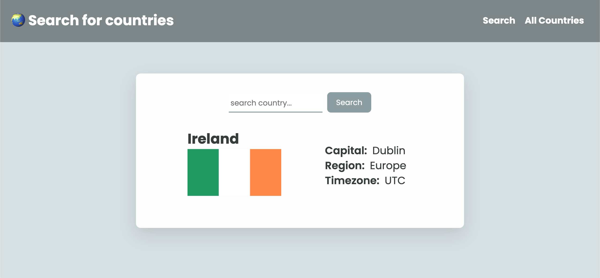

# 🌏 Country API Search

## Table of Contents

- [Introduction](#introduction)
- [Installation](#installation)
- [Live Demo](#usage)
- [API Routes](#api-routes)
- [Contributing](#contributing)
- [License](#license)

## Introduction

This is a project that use **React** (frontend), **NodeJS**/**Express** (backend).

You can:

- search for a country's info
- display all the countries

## Installation

1. Clone the repository: `git clone <git@github.com:Fanpeng-L/country-api-fetch.git>`
2. Navigate to the root directory: `cd country-api-fetch`
3. Install backend and frontend dependencies:

   ```bash
   cd frontend
   npm install
   npm run dev

   cd backend
   npm install
   npm run dev
   ```

4. Access the application at http://localhost:5173

## Live Demo

**[Click here 🔗 to try live demo!](https://serene-bonbon-04ecf7.netlify.app/)**

Preview:



## API Routes

(API source: [REST countries](https://restcountries.com/#endpoints-name))

- `https://restcountries.com/v3.1/all`

  - `GET`: Retrieves all countries data

- `https://restcountries.com/v3.1/name/{name}?fullText=true`
  - `GET`: Retrieve a single country data
